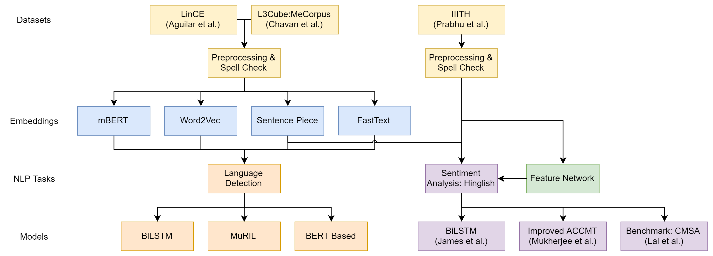
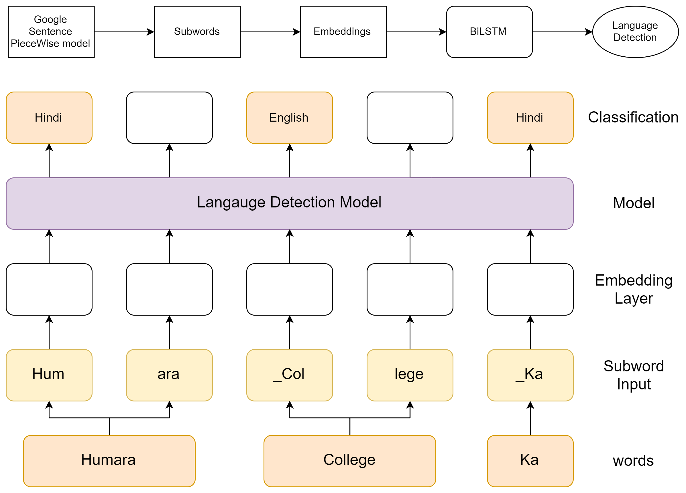
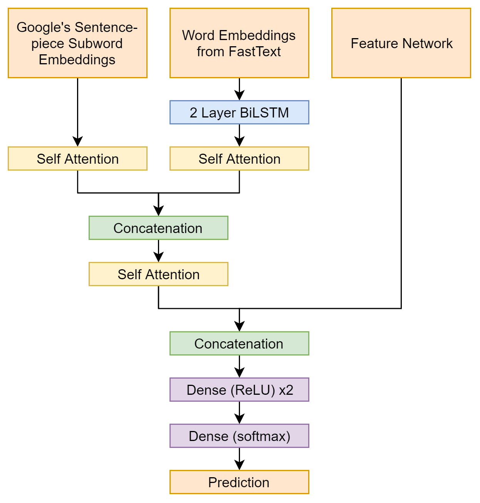

# Language Detection in Hinglish
Code for CSCI 544 Final Project for Group 20

Group Members:
- Abhiruchi Patil
- Harshitha Belagavi Rajaprakash
- Mithesh Ramachandran
- Sidh Satam
- Deepayan Sur
- Bhavik Upadhyay

# Introduction

The project focuses on Language Detection (LD) in Code-Switched data for
English and low-resource Indian languages, particularly Hindi. The
primary objective is to address challenges associated with analyzing
multilingual and code-switched (CS) text, where code-switching involves
alternating between two or more languages within a conversation or
discourse. To illustrate, consider the example:

\(a\) Main topic of today’s discussion.

\(b\) Main aaj waterpark gaya.

In this example, (a) represents an English sentence, while (b) is a
Hindi-English CS sentence. The word "Main" in (b) stands for ’me’ in
Hindi, despite sharing the same spelling as its English counterpart. The
project aims to bolster language processing systems in handling complex
linguistic phenomena by utilizing spell-checking, sub-word embeddings,
and machine learning algorithms. Developing a Feature Network
incorporating surface characteristics and monolingual sentence vector
representations enhances overall system performance, especially with
fewer training instances. While emphasizing LD, the impact of these
embeddings extends to various NLP tasks like named entity recognition,
part-of-speech tagging, and machine translation. Cross-language
embeddings enhance multilingual model performance, advancing
cross-lingual NLP applications. Additionally, the project evaluates the
utility of these embeddings in Sentiment Analysis (SA), which is
particularly beneficial for languages lacking extensive labeled datasets
or sophisticated pre-trained models. The code used in this research is
made available [1].

# Methodology

Figure <a href="#fig:methodology" data-reference-type="ref"
data-reference="fig:methodology">[fig:methodology]</a> provides an
overview of the approach taken in this paper. The following subsections
describe these steps in detail.

## Datasets

In this project, three datasets were utilized, the first being the IIITH
Hindi-English CS dataset with sentiment annotations, which contains
3,879 sentences annotated for the sentiment. The second dataset is the
Linguistic Code-switching Evaluation (LinCE) dataset , a centralized
benchmark for multiple code-switched language pairs annotated for
various NLP tasks. This dataset contains 7,421 sentences. The third
dataset is the L3Cube-MeCorpus is a large CS Marathi-English corpus with
5 million social media sentences.

## Embeddings

The study by posited the notion that developing multilingual embeddings
could potentially enhance LD within a low-resource environment. The
objective was to encompass frequently occurring words in a manner that
determines their significance while simultaneously ensuring diversity
among sub-words to minimize redundant information capture, thereby
constructing a valuable and varied sub-word vocabulary list. To achieve
this, the model architecture proposed by was referenced, employing a
sentence piece model for sub-word generation and subsequent embedding
creation.

SentencePiece functions as an unsupervised text tokenizer and
detokenizer specifically tailored for neural network-based text
generation systems, where the vocabulary size is predetermined prior to
neural model training. This method implements subword units, such as
byte-pair encoding (BPE) and unigram language model, augmenting these
with direct training from raw sentences. It is crucial to note that
SentencePiece treats sentences purely as sequences of Unicode
characters, devoid of language-specific logic. In our project, using
sentence piece models was instrumental in generating embeddings. While
the labeling of each word’s language within a given utterance was
imperative, it was equally crucial to incorporate contextual information
from surrounding words. This step aimed to tackle challenges arising
from orthographic similarities between words in different languages and
the existence of out-of-vocabulary tokens. A BiLSTM model was employed
to address these complexities, mirroring the experimental setup proposed
.

FastText, developed by Facebook’s AI Research (FAIR) lab , presents a
groundbreaking approach to word embeddings by leveraging sub-word
information, such as character-level n-grams. This methodology is
particularly advantageous in capturing complex morphology and
effectively handling out-of-vocabulary words, which proves beneficial
for languages featuring diverse word forms. FastText excels in
processing extensive text data and accommodating varied linguistic
structures. Its versatility renders it invaluable across applications
like SA, LD, and document categorization, owing to its innovative
sub-word modeling that significantly influences the landscape of NLP.
FastText addresses the challenges diverse languages pose and bolsters
the robustness of language processing systems. Motivated by these
advantages, we integrated an additional embedding layer utilizing
FastText to encapsulate contextual information and other linguistic
structural properties. Subsequently, these embeddings replaced the
SentencePiece embedding layer within a simple BiLSTM model, allowing for
a richer representation of linguistic nuances and contextual information
and enhancing the model’s comprehension and adaptability across diverse
language structures.

In exploring NLP embedding options, we evaluated prominent models,
including mBERT and Word2Vec. Google’s Word2Vec excels in generating
dense vector representations, capturing semantic relationships vital for
NLP tasks. However, integrating it with BiLSTM models faced challenges
in handling multilingual data. Multilingual BERT (mBERT) , designed for
diverse languages, exhibited superior performance in cross-lingual
sentiment analysis (SA) and language detection (LD). However, limited
data posed challenges for low-resourced languages like Hindi, resulting
in unsatisfactory performance. The small Hindi corpus constrained
mBERT’s vocabulary and hindered effective model training. Resource
constraints prohibited continuous training or starting from scratch with
a BERT-base, complicating optimal performance achievement. It is crucial
to overcome these challenges to improve the effectiveness of pre-trained
models like mBERT in settings with restricted language resources.

## Model Architecture

The constructed model for this project comprises a singular BiLSTM
layer, utilizing the subword embeddings from the different embedding
models described in the previous subsection as the input. Figure
<a href="#fig:LDarch" data-reference-type="ref"
data-reference="fig:LDarch">1</a> illustrates this model.

<figure id="fig:LDarch">

<figcaption>Model Architecture for Language Detection</figcaption>
</figure>

# Results and Discussions

| **Languages (LinCE dataset)**  | **Baseline BiLSTM** | **ELMo** | **Our Work** |
|:------------------------------:|:-------------------:|:--------:|:------------:|
| Hindi-English (SentencePiece)  |       92.34%        |  96.21%  |  **96.19%**  |
|    Hindi-English (FastText)    |       92.34%        |  96.21%  |    95.80%    |
| Nepali-English (SentencePiece) |       93.29%        |  96.19%  |  **96.31%**  |
|   Nepali-English (FastText)    |       93.29%        |  96.19%  |    94.70%    |

Observably, a substantial improvement in accuracy was achieved using a
simplistic BiLSTM model using embedding layers focusing on subword
generation as opposed to the baseline BiLSTM models used in . This
positive outcome prompts expectations of further enhancements when
integrating state-of-the-art (SOTA) BERT models into the system, thereby
potentially amplifying performance metrics. We can see the model with
sentence-piece embeddings performing marginally better than the model
with Fasttext embeddings as SentencePiece focuses on subword
tokenization and encoding, making it useful for handling various
languages and out-of-vocabulary words. On the other hand, FastText is
more oriented towards word and text representation using embeddings.

# Findings and Conclusions

<figure id="fig:SAarch">

<figcaption>Model Architecture for Sentiment Analysis</figcaption>
</figure>

## Pretrained Embeddings for Sentiment Analysis

**Feature Network:** For SA, exploiting syntactic cues in code-switched
text enhances understanding beyond semantic information. introduced a
feature network incorporating additional sentence-level features as
follows: (i) capitalized words, (ii) words with repeated last letters,
(iii) repeated punctuation, and (iv) exclamation marks at the end. They
also proposed calculating aggregate positive and negative sentiment
polarity scores using SentiWordNet on each word. This Feature Network is
concatenated with the output of the LSTM layers and fed to the following
Dense layers.

**Model Architecture:** As illustrated in figure
<a href="#fig:SAarch" data-reference-type="ref"
data-reference="fig:SAarch">2</a>, the proposed architecture consists of
two major parts. The first part utilizes pre-trained subword embeddings
generated by Google’s sentence-piece model. For the second part, we use
FastText embeddings trained on our dataset. Following this, two BiLSTM
layers are added. For both types of embeddings, self-attention is
applied to infer the dominating features in both embeddings separately.
The outputs are concatenated and passed through another self-attention
mechanism, allowing the model to learn a hierarchical representation of
the input sequence, with attention to both the word and sentence level.
The output is concatenated with the feature network and passed through a
series of dense layers to obtain the prediction.

**Results:** Using a subword embedding model trained on a larger corpus
using sentence-piece as well as one trained on the main dataset for SA
using FastText, we achieved an F1 score of 0.81, beating the baseline
approach of (0.71), while utilizing an otherwise similar architecture
for the classification model. Further, this score was close to the
benchmark set by (0.83). We also showed that using a simple BiLSTM model
gave a poor F1 of 0.46 and did not seem to work in the case of
Hindi-English CS data; however, adding the Feature Network to a simple
BiLSTM improved the score by a small amount (0.01). Additional details
are available in appendix
<a href="#sec:appendix" data-reference-type="ref"
data-reference="sec:appendix">6</a>.

## Language Detection: Cross-Language Embeddings

We leveraged a substantial corpus to explore patterns and
characteristics within language families. Our research showed us that
insights gained from one linguistic group can be effectively applied to
another. We concentrated on two distinct language families: Aryan
languages (Hindi, Marathi, Konkani, and Nepali) and Romantic languages
(Latin, Italian, Spanish, and Portuguese). When two languages are
similar and belong to the same language family, they may have common
phonology, indicating possible common fragments of words; sub-word
embeddings can be useful in capturing this information. For our project,
we used the L3Cube Marathi corpus, which has around 5 Million
code-switched sentences. We then used these embeddings on the Hindi and
Nepali LinCE datasets and achieved validation accuracies close to and in
some cases, beating the baseline metrics. Details for these results are
available in appendix <a href="#sec:appendix" data-reference-type="ref"
data-reference="sec:appendix">6</a>. We could identify commonalities and
differences across these language groups by employing this comparative
approach. This observation highlights the possibility of applying
linguistic information across diverse language families.

## Preprocessing - Spell Check for Code Switched Data

Various methods were applied to enrich the diversity of CS word
variations. The process involved introducing noise as an additional
vowel to words, randomly deleting a vowel, providing multiple possible
endings and variations for words based on phonetic pronunciation, and
applying linguistic concepts such as nasalization. These processes were
combined to generate diverse CS words, establishing mappings between the
original and modified forms. Identifying the most frequently occurring
words in a given set of sentences and correcting misspelled words based
on created mappings were also part of the approach. We also calculated
the percentage difference between the datasets before and after
variation handling. We manually inspected a sample of the variations to
ensure correct implementation, achieving a 5% difference.

We tested the preprocessing methodology on FastText on Hindi and Nepali
LinCE datasets. We were able to improve on the baseline BiLSTM results
presented by and our implementation of their work. Observably, a
substantial improvement in accuracy was achieved when using a simplistic
BiLSTM mode with a specialized embedding focussing on the subwords. This
positive outcome prompts expectations of further enhancements when
integrating state-of-the-art (SOTA) BERT models into the system, thereby
potentially amplifying performance metrics. Details for these results
are available in appendix
<a href="#sec:appendix" data-reference-type="ref"
data-reference="sec:appendix">6</a>.

# Future Scope

Future studies could concentrate on improving pre-training approaches
and investigating practical implementations such as Extend M-BERT.
Hybrid models, integrating handwritten rules with deep learning, promise
enhanced efficiency. Seamless alignment of bilingual embeddings at word
and sentence levels is crucial, aiding nuanced semantic capture across
languages. This alignment facilitates effective knowledge transfer,
particularly for low-resource languages. Attention to robust text
normalization methods, emphasizing ethical considerations, addressing
biases, and promoting inclusivity in NLP applications is also essential.
Research should prioritize generalized embeddings tailored for diverse
NLP tasks, contributing to the field’s advancement.

# Appendix: Additional Results

Detailed tables of results are presented in this section. Table
<a href="#tab:SAResults" data-reference-type="ref"
data-reference="tab:SAResults">[tab:SAResults]</a> illustrates the
results obtained through our experiments on Sentiment Analysis on the
IIITH dataset. Table
<a href="#tab:CrossLangResults" data-reference-type="ref"
data-reference="tab:CrossLangResults">[tab:CrossLangResults]</a>
describes the results of performing Language Detection on various
language pairs from LinCE using Cross Language Embeddings as well as
using preprocessing methods as described earlier.

|   **Embedding Method**   |     **Classification Model**     |  **F1**   |
|:------------------------:|:--------------------------------:|:---------:|
| ACCMT (Mukherjee et al.) |                                  |  0.7093   |
|    CMSA (Lal et al.)     |                                  | **0.827** |
| FastText + SentencePiece | Modified ACCMT + Feature Network |  0.8081   |
|         FastText         |              BiLSTM              |  0.4653   |
|         FastText         |     BiLSTM + Feature Network     |  0.4744   |

|                   |                      |              |                           |                        |
|:-----------------:|:--------------------:|:------------:|:-------------------------:|:----------------------:|
| **Test Language** | **Embedding Method** | **Baseline** | **Accuracy (15 epochs)**  |                        |
|                   |                      |              | **Without preprocessing** | **With preprocessing** |
|       Hindi       |       FastText       |    92.34%    |          93.37%           |         93.58%         |
|       Hindi       |       Word2Vec       |    92.34%    |          92.25%           |         93.37%         |
|      Nepali       |       FastText       |    93.29%    |          90.54%           |         92.08%         |
|      Nepali       |       Word2Vec       |    93.29%    |          87.02%           |         88.42%         |

[1] https://github.com/sidh26/Language-Detection-in-Hinglish
